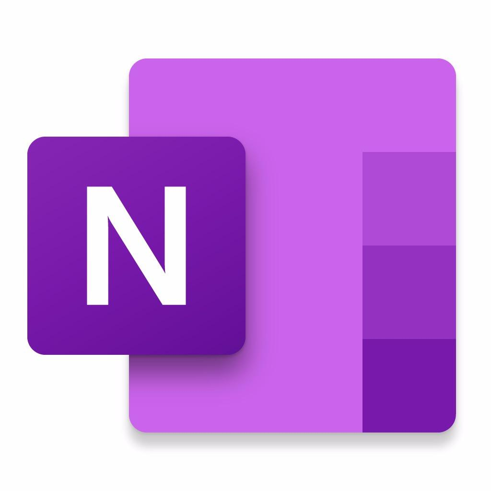

# 🤖 OneNote AI Assistant

A professional AI-powered digital assistant specifically designed to solve Microsoft OneNote issues with dual language support (Chinese/English).



## ✨ Features

### � Dual AI Integration
- **Alibaba Cloud DashScope**: Advanced image understanding with Qwen-VL-Plus model
- **DeepSeek API**: Powerful logical reasoning and code understanding
- Automatic fallback and intelligent provider selection

### 🌍 Full Internationalization
- Complete Chinese/English UI translation
- Dynamic language switching
- Localized AI responses and knowledge base

### � Image Analysis
- Upload OneNote screenshots for AI-powered problem diagnosis
- Drag & drop or paste image support  
- Intelligent image content analysis

### 📚 Comprehensive Knowledge Base
Professional solutions for common OneNote issues:
- **Sync Issues**: File synchronization, content loss, slow sync
- **Loading Problems**: Blank pages, slow loading, incomplete content
- **Search Functions**: No results, slow search, inaccurate results  
- **Print Issues**: Layout problems, printing failures, incomplete output
- **Performance**: Slow operation, freezing, crashes
- **Account & Permissions**: Login issues, access problems
- **Mobile Issues**: Mobile app synchronization, cross-device problems
- **Handwriting & Drawing**: Stylus responsiveness, ink features
- **Data Recovery**: Deleted notes recovery, backup solutions

### 🎯 User Experience
- Modern responsive design
- Real-time status indicators
- Quick suggestion buttons
- Smooth animations and transitions
- Professional avatar interactions

## 🚀 Quick Start

### Prerequisites
- Node.js 16.0 or higher
- npm or yarn package manager

### Installation

1. **Clone the repository**
```bash
git clone https://github.com/yourusername/onenote-ai-assistant.git
cd onenote-ai-assistant
```

2. **Install dependencies**
```bash
npm install
```

3. **Configure API Keys**
Copy `.env.example` to `.env` and configure your API keys:
```bash
cp .env.example .env
```

Edit `.env` file:
```env
# DeepSeek API Configuration
DEEPSEEK_API_KEY=sk-your-deepseek-api-key-here

# Alibaba Cloud DashScope Configuration  
DASHSCOPE_API_KEY=sk-your-dashscope-api-key-here

# AI Provider Selection (deepseek/dashscope)
AI_PROVIDER=dashscope

# Server Port
PORT=3000
```

4. **Start the application**
```bash
npm start
# or
node server.js
```

5. **Access the application**
Open your browser and navigate to `http://localhost:3000`

## 🔧 Configuration

### API Keys Setup

#### DeepSeek API
1. Visit [DeepSeek Platform](https://www.deepseek.com/)
2. Register and create an API key
3. Add to `.env`: `DEEPSEEK_API_KEY=sk-your-key-here`

#### Alibaba Cloud DashScope  
1. Visit [Alibaba Cloud DashScope](https://dashscope.console.aliyun.com/)
2. Create an API key
3. Add to `.env`: `DASHSCOPE_API_KEY=sk-your-key-here`

### Provider Selection
- Set `AI_PROVIDER=dashscope` for image understanding support
- Set `AI_PROVIDER=deepseek` for code analysis and logical reasoning

## 📁 Project Structure

```
onenote-ai-assistant/
├── public/                 # Frontend files
│   ├── index.html         # Main HTML page
│   ├── styles.css         # Styling
│   ├── script.js          # Main JavaScript logic
│   └── i18n.js           # Internationalization
├── server.js              # Node.js server
├── package.json           # Dependencies and scripts
├── .env.example           # Environment template
├── .gitignore            # Git ignore rules
└── README.md             # Documentation
```

## 🌐 API Endpoints

- `GET /` - Main application page
- `POST /api/chat` - Send message to AI assistant
- `GET /api/status` - Check system configuration status
- `GET /api/knowledge` - Get knowledge base (supports ?language=en)
- `POST /api/test-api-key` - Test API key configuration

## 🛠️ Development

### Running in Development Mode
```bash
npm run dev
```

### Building for Production
```bash
npm run build
```

### Testing API Configuration
```bash
npm run test-config
```

## 📝 Usage Examples

### Basic Text Query
```
User: OneNote sync is very slow
AI: I'll help you solve the OneNote sync issue...
```

### Image Analysis
1. Upload a OneNote screenshot
2. Describe the issue: "The interface shows an error"
3. Get AI-powered diagnosis and solutions

### Language Switching
- Click the 🌐 button in the top-right corner
- All interface elements switch between Chinese and English
- AI responses match the selected language

## 🤝 Contributing

1. Fork the repository
2. Create a feature branch (`git checkout -b feature/amazing-feature`)
3. Commit your changes (`git commit -m 'Add some amazing feature'`)
4. Push to the branch (`git push origin feature/amazing-feature`)
5. Open a Pull Request

## 📄 License

This project is licensed under the MIT License - see the [LICENSE](LICENSE) file for details.

## � Links

- [DeepSeek API Documentation](https://www.deepseek.com/docs)
- [Alibaba Cloud DashScope](https://help.aliyun.com/zh/dashscope/)
- [OneNote Support](https://support.microsoft.com/en-us/onenote)

## ⭐ Star History

If this project helps you, please consider giving it a star! ⭐

---

**Built with ❤️ for OneNote users worldwide**
> 1. 访问 [DeepSeek官网](https://www.deepseek.com/)
> 2. 注册账户并登录
> 3. 在控制台中创建API密钥
> 4. 将密钥复制到 `.env` 文件中

#### 第三步：启动服务
```bash
# 开发模式
npm run dev

# 生产模式
npm start
```

#### 第四步：访问应用
打开浏览器访问：`http://localhost:3000`

## 使用指南

### 基本对话
1. 在输入框中描述您遇到的OneNote问题
2. 点击发送按钮或按回车键
3. AI助理会分析问题并提供专业解决方案

### 快速帮助
- 点击预设的问题建议快速开始对话
- 使用侧边栏的快速帮助按钮
- 浏览知识库中的常见问题分类

### 交互技巧
- 详细描述问题症状可获得更准确的解决方案
- 可以询问具体的操作步骤
- 支持追问和进一步咨询

## 技术架构

### 后端技术
- **Node.js + Express**：Web服务器框架
- **DeepSeek API**：AI对话引擎
- **本地知识库**：OneNote故障解决方案数据库

### 前端技术
- **原生JavaScript**：交互逻辑
- **CSS3**：响应式设计和动画效果
- **Font Awesome**：图标库

### 特色功能
- **智能降级**：API失败时自动使用本地知识库
- **实时对话**：流畅的聊天体验
- **响应式设计**：支持桌面和移动设备
- **无障碍支持**：符合Web无障碍标准

## 目录结构

```
OneNote AI Avatar/
├── public/              # 前端静态文件
│   ├── index.html      # 主页面
│   ├── styles.css      # 样式文件  
│   ├── script.js       # 交互脚本
│   └── onenote.jpg     # 头像图片
├── server.js           # 后端服务器
├── package.json        # 项目配置
├── .env               # 环境变量
├── .env.example       # 环境变量示例
└── README.md          # 说明文档
```

## API接口

### POST /api/chat
发送消息给AI助理
```json
{
  "message": "OneNote同步很慢怎么办？"
}
```

响应：
```json
{
  "success": true,
  "response": "OneNote同步慢的解决方案...",
  "timestamp": "2024-01-01T12:00:00.000Z"
}
```

### GET /api/knowledge
获取知识库信息
```json
{
  "success": true,
  "knowledge": {
    "同步问题": {...},
    "性能问题": {...}
  }
}
```

## 故障排除

### 常见问题

#### 1. API密钥配置错误
- 确保 `.env` 文件中的API密钥正确
- 检查API密钥是否有效且有足够的配额

#### 2. 端口被占用
- 修改 `.env` 文件中的 `PORT` 值
- 或者关闭占用3000端口的其他程序

#### 3. 依赖安装失败
```bash
# 清除缓存重新安装
npm cache clean --force
rm -rf node_modules
npm install
```

#### 4. 头像图片不显示
- 确保 `public/onenote.jpg` 文件存在
- 检查图片格式是否支持（jpg、png、gif）

## 扩展开发

### 添加新的问题类型
在 `server.js` 中的 `onenoteKnowledge` 对象中添加新分类：

```javascript
const onenoteKnowledge = {
  // 现有分类...
  "新问题类型": {
    "symptoms": ["症状1", "症状2"],
    "solutions": ["解决方案1", "解决方案2"]
  }
};
```

### 自定义样式
修改 `public/styles.css` 文件自定义界面外观。

### 集成其他AI模型
修改 `callDeepSeekAPI` 函数以支持其他AI服务提供商。

## 许可证

MIT License

## 技术支持

如果您在使用过程中遇到问题，请：
1. 检查上述故障排除指南
2. 查看控制台错误信息
3. 确保网络连接正常
4. 验证API密钥配置正确

---

💡 **提示**：这个数字人助理专门为OneNote用户设计，具有丰富的故障排除经验和专业知识，能够帮助您快速解决各种OneNote使用问题。
